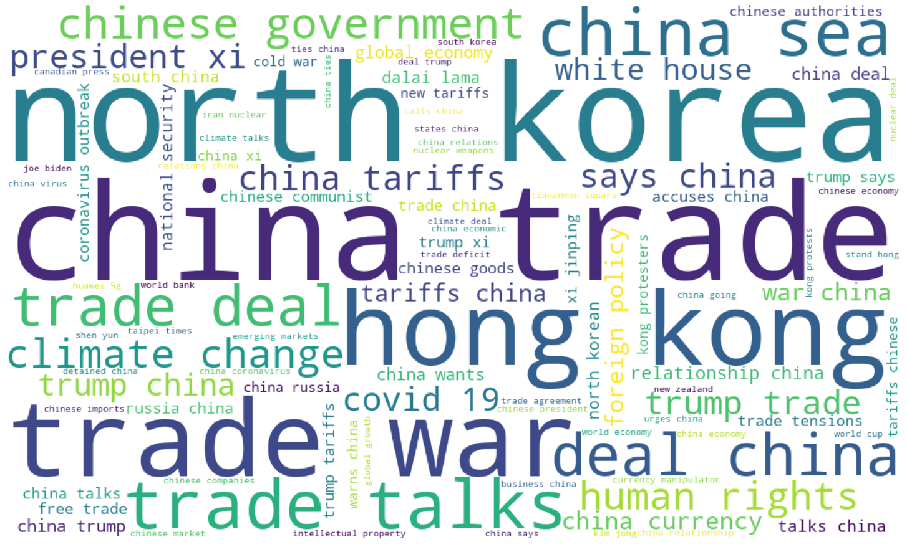

## What we are trying to do?

Quotations are often used as a literary device to represent someone's point of view. We believe that these Quotations used in the news related to China represent the attitudes of Western politicians and, to some extent, of the Western public towards China. By analyzing those Quotations, we hope to answer the question: what are the attitudes of the Western world towards China?

We use keyword filtering to get the related quotations, then apply KeyBERT, a minimal keyword extraction technique, to the quotations and their left and right contexts to create keywords and key phrases that are most similar. We also aggregate keywords into more general topics. Then, we use `Twitter-roBERTa-base` for our sentiment analysis on each quotation and get a sentiment score from -1 ~ 1 to represent the positive scale of the attitude of that quotation. 

We will present our data story in the following structure:

- ​	[How does our data look like?](#how-does-our-data-look-like-?) 

- What are people talking about when they talk about China?
- What are their attitudes?
- The difference in attitudes?
- Interesting findings?

## How does our data look like?

The [Quotebank](https://zenodo.org/record/4277311#.YbN3I32ZNO8) data-set we use contains English quotations gathered from online news articles in the period between 2008 and 2020. We filter the data to obtain quotations relating to China which were uttered by a person with a western background as defined by their nationality. 

The data filtering was done by checking whether specific keywords relating to china can be found in either the title, quotation, or local left and right context of the quotation. We checked for the following keywords: 

`['jinping xi', 'xi jing ping', 'xi jinping', 'president xi', 'china', 'chinese', 'beijing', 'peking', 'sino-']`

In order to determine whether a certain speaker is from a 'Western' background, we check whether they come from one of the countries in the political definition of [Western countries](https://sashamaps.net/docs/maps/list-of-western-countries/). As mentioned before, after filtering we are left with approximately 2 million article-quotation pairs.

#### Overview of the Filtered Data

Below we see a map of the number of quotations per country in the western world, note that the `QuotationScale` is the logarithm of the number of quotes. As we can see the vast majority of quotes are from the US, with a smaller amount of quotes coming from all other countries. Therefore, when observing the results please take into account that most of the data the investigation is based on are from the US.



📈 The derived dataset we used for analysis consists of 1,954,147 quotes related to China. As shown in the following plot, the number of quotes increases gradually since 2016, reaching a peak of 444,118 in 2019. The subsequent drop is merely due to lack of data in 2020, as only the quotes from the first two quaters were collected in the original dataset.



🌍 Taking a closer look at the geographical distribution of quotes, they are uttered by 81,581 speakers from 58 western countries, with USA, UK, Australia, Canada, and France ranking as top 5 countries with the most quotes. 



🗣 Considering the number of quotes uttered by each speaker, the most frequent speaker is Donald Trump with 196,246 quotes about China, followed by Barack Obama who has 79,789 quotes in our dataset!

🚹 🚺 As for gender identities of speakers, male speakers make up 75.8% of the quotees, while female speakers make up 24% of the quotees, after filtering those speakers with multiple gender identities or merely without data. 



🪧 Regarding polical affiliations, 2,822 speakers are the Democrats (🐎, 🇺🇸) and 2,678 of them are the Republicans (🐘, 🇺🇸). 



## What are people talking about when they talk about China?

To understand people's attitudes, first, we need to understand what they are talking about. And we can figure this out by extracting keywords from quotations. We choose the pre-trained model KeyBERT to extract the five possible bigram keywords for each quotation and use these five keywords to represent this quotation. After extracting keywords, we can infer what events people are discussing by associating keywords with news events. 

We generate a word cloud plot for all the keywords of quoteations to show the frequency of keywords mention in the whole dataset of all the years we have.

Overall year, the most frequently mentioned keywords are:



Surprisingly,  `North Korea` is the most frequently mentioned keyword.  This might be because we use bigram word encoding, but also due to the reason that since the change of regime in North Korea in 2011, when Kim Jong-un became leader, and since North Korea has been attempting to conduct missile and nuclear bomb tests from 2013-2017, the country has attracted a lot of attention and discussion in the international world in the intervening years. At the same time, China and North Korea, two of the most talked-about socialist countries close to each other, are widely perceived to be closely linked and supportive of each other, and therefore will eventually refer to China's attitude or moves when talking about North Korea. It is therefore understandable that North Korea appears most frequently as a keyword in China-related quotations. The rest of the keywords: `trade war`, `Hong Kong`, `China sea`,`Chinese government`, `human rights`, and `climate change` are more reasonable. The trade war between the United States and China from 2018 to early 2020 has been a prominent topic of conversation for years, with multiple meetings between leaders and deals made or not reached being covered and discussed in the press regularly. China's human rights issues and Chinese governing have always been the focus of attention and attack in the Western media. And disputes over China's territorial seas and discussions about climate change have continued to develop in the 2008-2020 era. Although the coronavirus outbreak has been a topic of discussion for everyone for the last two years, the total number of mentions of this keyword in the dataset does not rank high, mainly because the dataset only contains news quotes up to the first half of 2020.

Moreover, we create a bar chart race plot to see how the keywords change in time by counting the keyword quarterly. You can see in the plot that the keywords change frequently for the most part, but in some years some topics dominate the entire ranking. During 2017,  the keyword `North Korea` consistently occupy the top spot on the list, with many more mentions than other topics in the same period. In 2018, keywords related to *trade war* are at the top of the list.



For the top 5 countries with the most quotes: USA, UK, Australia, Canada, and France, we can also take a look of what these countries' most mentioned keywords.



As can be seen, the mentioned keywords vary between countries. The United States is fairly representative, mainly because most of the quotations come from US speakers. UK has some quotations about 5g and HUAWEI since HUAWEI tried to install the 5g equipment and then the UK banned it. Australia and China used to be closed before 2017 but the relations began to deteriorate because of their different stances on the South China Sea dispute, which may be the reason why the keywords `Australia China/ china Australia ` and `China sea` show up. The top 4 out of 5 mentioned keywords for Canadian speakers are related to the so-called two Michaels being detained, which is widely considered a retaliatory action after the Chinese tech executive Meng Wanzhou was arrested in Vancouver. Interestingly, France is the most concerned about economic topics out of the five countries.

### How do Western speakers feel about the topics presented in the Western press

When we look at the various topics we saw the general trend that a lot of news seems to focus on the negative things that are associated with China. As an example, one may take the Hong Kong protests which in itself could be interpreted as a negative event related to China. However, is it also the case that the quotations about these topics carry a negative connotation towards China?
In this section, we will explore the opinion of Western speakers regarding the main topics presented in the previous section.

To gauge the opinion of Western quotees, we calculated the sentiment index per quotation in the dataset, and aggregate them per topic. Normally, we would not be able to aggregate the quotations per topic, as keywords regarding the same topic may be very different, e.g. 'corona virus' and 'covid-19 outbreak'. The way we deal with this is to train a classifier that classifies keywords into pre-specified topics. We train this classifier by leveraging the fact that each quotation-article pair has a list of 5 keywords. What we do is segment the top 50 most frequent keywords per year into several meaningful categories, we then assume that everything that is in a list with one of the top 50 keywords is related to that keyword topic. We then label all keywords that only occur once in the dataset as outliers if they are unrelated (not in the same list) to the top 50 keywords. We then train the classifier on this labeled data and let it predict on the keywords that were not labeled in the original 'manual' labeling. 

Our manual labeling resulted in the main topics shown above. Note that sporadic news is not included in the overview, as we are not able to track these over subsequent years. An example of such a sporadic news story could be when 3 UCLA basketball players were accused of shoplifting in China, and were subsequently detained. Another thing to keep in mind is that the overview, and subsequent analysis assumes that all the important topics of a certain year show up within the top 50 most frequent keywords of that year. 

As we can see, the plot shows interesting patterns. If we look at the average sentiment of all the quotations we see that the sentiment drops quite suddenly after 2016. Part of the drop can be explained by some of the classified topics, this can be seen in the fact that the `others` category stays relatively the same in 2017, while the average sentiment index of all the quotations drop. This indicates that the topics that are not in the others category became more negative in 2017. However, after 2017 the `others`category also drops, meaning that there is some unexplained change in the average sentiment of the `others` category. We have not found an explanation for this large change in average sentiment, but a possible explanation may be that news regarding China in general became more negative. 

Another interresting observation can be made when looking at the trend of the topic `trade_relations`. We see that the sentiment jumps up in 2014, which coincides with the [China–Australia Free Trade Agreement](https://en.wikipedia.org/wiki/China%E2%80%93Australia_Free_Trade_Agreement). Furthermore, in 2014 the second most commonly quoted quote relating to `trade_relations` was that of Former Democratic Sen. Max Baucus which stated *no bilateral relationship is more important than the U.S. and China's*. However, in later years, we see the sentiment drop to neutral, and even later to negative as the [US-China trade war](https://en.wikipedia.org/wiki/China%E2%80%93United_States_trade_war) began. However, in 2020 we see a large uptick in the sentiment index relating to the topic `trade_relations`, this uptick in sentiment happened after the signing of the phase one US-China trade agreement on January 15th 2020. The impact of this trade agreement on the sentiment index can be seen in the fact that before January 15th, the average `trade_relations` sentiment was -0.08, while afterwards it changed to +0.09. We confirmed this change in sentiment with a independent samples t-test, which reached statistical significance. 

In general, it seems that the sentiment for the extracted topics lie below the zero line, indicating that most topics show a negative sentiment when looking at the aggregated quotes. This is however to be expected, as it is known that people are more attentive to [negative news](https://www.pnas.org/content/116/38/18888#sec-3), this combined with our approach of extracting topics from the top 50 keywords, means that the topics likely contain a larger amount of negative news.

### How do different groups of people feel about China
